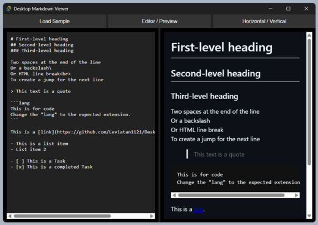

# 
Desktop Markdown Viewer

|  
**Desktop Markdown Viewer** is a desktop application to view & edit Markdown.  Edit your Markdown and see changes reflected instantly in the preview!
 |  |
| :--- | :---: |

## How it works

The application converts Markdown to HTML in real-time as you type. The layout is fully editable and the preview updates automatically with a short delay to optimize performance.

Your content and preferences (editor layout and orientation) are automatically saved, so your work persists between sessions.

## Features

- **Markdown editor** — Write and edit Markdown directly in the application.
- **Real-time preview** — Changes are reflected automatically in the preview.
- **Multiple view modes** — Toggle between three different layouts:
  - **Editor + Preview** — Split view to edit and preview simultaneously.
  - **Preview only** — Focus on the final result.
  - **Editor only** — Distraction-free writing mode.
- **Flexible orientation** — Change the layout between horizontal, vertical, and their reverse variants.
- **Load sample** — Button to load a sample file and explore Markdown capabilities.
- **Auto-save** — Your content and preferences are automatically saved.
- **GitHub-like styling** — Preview uses familiar GitHub-like styles.

## Usage

Download the [Latest Release](https://github.com/Leviatan1121/DesktopMarkdownViewer/releases/latest) and install the app using the exe or msi (for elevated rights) files.

**Requirements:** Windows 10 or later.
